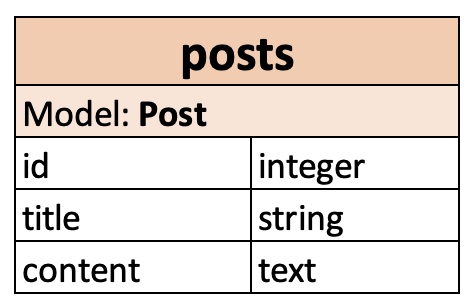

# Model post

This project presents the developing of a simple post model using AJAX (Asynchronous JavaScript and XML) from scratch.

## Preview

The project was upload to heroku and can be seen here: [Model post](https://serene-inlet-93108.herokuapp.com)

## Table of contents

* [Ruby and Rails versions](#ruby-and-rails-versions)
* [Gems](#gems)
* [1. Adding Boostrap](#1-adding-boostrap)
* [2. Defining the model and controller](#2-defining-the-model-and-controller)
* [3. Implementing the CRUD with AJAX](#3-implementing-the-crud-with-ajax)
  + [3.1 The routes](#31-the-routes)
  + [3.2 Creating the Index](#32-creating-the-index)
  + [3.3 New](#33-new)
  + [3.4 Show](#34-show)
  + [3.5 Create](#35-create)
  + [3.6 Edit](#36-edit)
  + [3.7 Update](#37-update)
  + [3.8 Delete](#38-delete)

## Ruby and Rails versions

* ruby '2.6.1'
* gem 'rails', '~> 5.2.6'

## Gems

```ruby
gem "bootstrap", "~> 5.1"
gem "jquery-rails", "~> 4.4"
gem "faker", "~> 2.19"
gem "font-awesome-rails"
```

## 1. Adding Boostrap

The gems are integrated and bundled:

```ruby
# gemfile.rb

gem "bootstrap", "~> 5.1"
gem "jquery-rails", "~> 4.4"
gem "font-awesome-rails"
```

In the javascript manifest Bootstrap is require as:

```javascript
// application.js

//= require jquery
//= require popper
//= require bootstrap
```

And it is called from the stylesheets files as:

```css
/*
application.css 

*= require font-awesome
*/
```

```css
/* home.scss */

@import 'bootstrap';
@import "font-awesome";
```
## 2. Defining the model and controller

<p align="center"></p>

The model is summarized in the previews images and its generated as:

```console
rails g model Post title content:text
```

The controller Post will be the one where the CRUD is going to take form:

```console
rails g controller Post
```

## 3. Implementing the CRUD with AJAX

### 3.1 The routes

The routes are defined as it can be seen below:

```ruby
Rails.application.routes.draw do
  root 'posts#index'
  get '/posts', to: 'posts#index', as: 'posts'
  get '/posts/new', to: 'posts#new', as: 'new_post'
  post '/posts', to: 'posts#create'
  get '/posts/:id', to: 'posts#show', as: 'post'
  get '/posts/:id/edit', to: 'posts#edit', as: 'edit_post'
  patch '/posts/:id', to: 'posts#update'
  delete '/posts/:id', to: 'posts#destroy'
end
```

### 3.2 Creating the Index

The partial form is added:

```ruby
# posts/_form.html.erb

<%= form_with(model: @post) do |form| %>
    <% if @post.errors.any? %>
        <div id="error_explanation">
            <h2><%= pluralize(@post.errors.count, "error") %> prohibited this Post from being saved:</h2> 
            <ul>
                <% @post.errors.full_messages.each do |message| %>
                    <li><%= msg %></li>
                <% end %>
            </ul>
        </div>
    <% end %>

    <div class="form-group">
        <%= form.label :title, 'Write your title' %>
        <%= form.text_field :title, class: "form-control" %>
    </div>

    <div class="form-group">
        <%= form.label :content, 'What are you thinking?' %>
        <%= form.text_area :content, class: "form-control" %>
    </div>

    <div class="actions">
        <%= form.submit %>
    </div>
<% end %>
```

The index will display the posts as the main view:

```ruby
# posts/index.html.erb

<div id="my_form"></div>
<div id="post"></div>

<div id="new_button" class="container py-2">
    <%= render 'new_button' %>
</div>

<div class="container">
    <% @posts.each do |post| %>
        <%= render 'posts', post: post %>
    <% end %>
</div>
```

In the controller:

```ruby
class PostsController < ApplicationController
  def index
    @posts = Post.order(:created_at).reverse_order
  end
end
```

### 3.3 New

The method is implemented in the controller as:

```ruby
# posts_controller.rb

def new
    @post = Post.new
end
```

Note that the links with the **"remote: true"** attribute indicate that the form will be submited by AJAX and not the normal submit mechanism.

```ruby
# posts/_posts.html.erb

<div>
    <%= link_to 'New post', new_post_path, remote: true, class: 'btn btn-info btn-lg', data: { disable_with: 'Creating...' } %>
    <%= link_to post, remote: true, class: 'btn btn-success' do fa_icon "eye 2x" end %>
    <%= link_to edit_post_path(post), remote: true, class: 'btn btn-warning' do fa_icon "edit 2x" end %>
    <%= link_to post, remote: true, method: :delete, data: { confirm: 'Are you sure about this?' }, class: 'btn btn-danger' do fa_icon "trash 2x" end %>
</div>
```

The method new is called with AJAX by the new.js file:

```javascript
// posts/new.js.erb

$('#my_form').append('<%= escape_javascript render('posts/form') %>');
$('#new_button').html(' ');
```

Then it can be seen in the logs that the processing belongs to javascript:
```
Started GET "/posts/new" for ::1 at 2021-11-08 18:04:09 -0300
Processing by PostsController#new as JS
```

### 3.4 Show

The method is implemented in the controller as:

```ruby
# posts_controller.rb
before_action :set_post, only: [:show]

def show
end
```

In the show.js file:

```javascript
// posts/show.js.erb

$('#post').html('<%= j render('posts/show') %>')
```

A new partial show is added to display the post:

```ruby
# posts/_show.html.erb

<div class="card my-2">
    <div class="card-body">
      <h5 class="card-title"><%= @post.title %></h5>
      <h6 class="card-subtitle mb-2"><%= time_ago_in_words(@post.created_at) %> ago</h6>
      <div class="container text-center">
        <p class="card-text"><%= @post.content %></p>
      </div>
    </div>
</div>
```

### 3.5 Create

The method is implemented in the controller as:

```ruby
# posts_controller.rb

def create
@post = Post.new(post_params)
    respond_to do |format|
        if @post.save
            format.js { render layout: false, notice: 'Post created!' }
        else
            format.json { render json: @posts.errors, status: :unprocessable_entity }
        end
    end
end
```

In the create.js file:

```javascript
// posts/create.js.erb

$('#posts').append('<%= j render('posts/posts', post: @post)%>');
$('#my_form').html(' ');
$('#new_button').append('<%= escape_javascript render('posts/new_button') %>')
```

### 3.6 Edit

The method is implemented in the controller as:

```ruby
# posts_controller.rb

before_action :set_post, only: [:show, :edit]

def edit
end
```

In the edit.js file:

```javascript
// posts/edit.js.erb

$('#my_form').html('<%= escape_javascript render('posts/form') %>')
```

### 3.7 Update
  
The method is implemented in the controller as:

```ruby
# posts_controller.rb

before_action :set_post, only: [:show, :edit, :update]

def update
    respond_to do |format|
        if @post.update(post_params)
          format.js { render layout: false, notice: 'Post updated!' }
        else
          format.json { render json: @posts.errors, status: :unprocessable_entity }
        end
    end
  end
```

In the update.js file:

```javascript
// posts/update.js.erb

$('#my_form').html(' ')
$('#post-<%= @post.id %>').replaceWith('<%= j render('posts/posts', post: @post) %>')
```

### 3.8 Delete
 
The method is implemented in the controller as:

```ruby
# posts_controller.rb

before_action :set_post, only: [:show, :edit, :update, :destroy]

def destroy
    @post.destroy
    respond_to do |format|
        format.js { render nothing: false, notice: 'Post destroyed!' }
    end
end
```

In the destroy.js file:

```javascript
// posts/destroy.js.erb

$('#post-<%= @post.id %>').empty();
```


